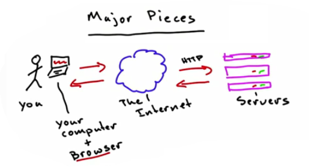
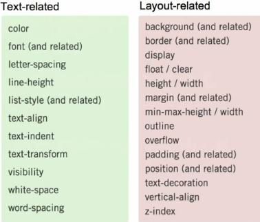

% Introdução ao Desenvolvimento Web
% Lucas Fialho Zawacki

Jabá Matehackers
=

\centerline{\includegraphics[height=1.5in]{assets/images/logo.png}}

## **Hackers + Espaço = Hackerspace**

<http://matehackers.org>

What is Web?
=

* Uma nuvenzinha (não confundir com cloud computing)

\begin{figure}
\centerline{\includegraphics[height=2in]{assets/images/web.png}}
 \caption{Arquiterura da Web. Retirado de udacity.com}
\end{figure}

O que diferencia um app desktop de um app web?
=

  * Interação
  * Tempo de resposta
  * Acesso

Programadores, designers e administradores
=

## **Desenvolvimento Web é o termo mais genérico de todos!**

Programadores, designers e administradores
=

## Operações?

**Servidores**: apache, nginx, lighttpd, mongrel, ...

**Bancos-de-dados**: mysql, postgresql, oracle, ...

**Versionamento e Deployment**: git, ftp, capistrano, ...

**Monitoramento**: daemons, cronjobs, monit, nagios, ...

Programadores, designers e administradores
=

##  Aplicação?

**Linguagens**: PHP, Ruby, Python, ASP, ...

**Tecnologia**: Web services, autenticação, criptografia, algoritmos ...

Programadores, designers e administradores
=

## Interação e Design?

**Estrutura**: HTML, CSS, Javascript, ...

**Visual**: Imagens, Cores, disposição de elementos

Frontend e Backend
=

## O que é um e o que é outro?

Backend: O que é um servidor Web?
=

#### Um software...

Que recebe requisições de diversos **clientes** e **serve** conteúdo para estes. Geralmente multithreaded, preparado para servir diversos arquivos estáticos e com suporte "interno" a linguagens.

#### Um computador...

Parrudo onde roda um software servidor.

HTTP
=

#### HTTP É a Web

Protocolo usado para comunicar os clientes com os servidores

Uso de verbos e recursos

Verbos mais usados são GET e POST

HTTP
=
#### Exemplo

    GET          /foo           HTTP/1.1
    Verbo        Recurso        Versão
    Method       Path

HTTP
=

#### Exemplo

    POST     /foo?name=bar      HTTP/1.1
    Verbo    Recurso            Versão
    Method   Path

GET x POST
=

* GET == ler
* POST == modificar

Respostas HTTP
=

* O servidor te envia: a versão de HTTP usada, um código de erro e um documento
* O documento __geralmente__ será um arquivo HTML, mas o cliente pode interpretar de várias maneiras ...

Respostas HTTP
=

## Status comuns

**200**: Ok

**302**: Found

**404**: Not Found

**500**: Server error

Respostas HTTP
=

\begin{figure}
\centerline{\includegraphics[height=2in]{assets/images/http.jpg}}
\caption{Códigos de Erro HTTP}
\end{figure}

Headers HTTP
=

* Além das informações citadas acima informações, cada mensagem HTTP leva junto 'headers'
* Headers são apenas linhas de texto num formato 'chave: valor'
* Alguns são muito úteis como o `Content-Type`

Headers HTTP
=

#### Uma visita a http://matehackers.org

    Conectando-se a matehackers.org na porta 80
    GET / HTTP/1.1
    User-Agent: curl/7.22.0 (i686-pc-linux-gnu) libcurl/7.22.0 OpenSSL/1.0.1 zlib/1.2.3.4 libidn/1.23 librtmp/2.3
    Host: matehackers.org
    Accept: */*

Headers HTTP
=

#### Resposta de http://matehackers.org

    HTTP/1.1 302 Found
    Date: Fri, 23 Nov 2012 02:34:07 GMT
    Server: Apache
    X-Powered-By: PHP/5.4.8
    Location: doku.php
    Content-Length: 0
    Content-Type: text/html

Conteúdo Estático e Dinâmico
=

* Servidores podem enviar arquivos já prontos
  * HTML, vídeos, músicas, ...

* Ou construí-los dinamicamente
  * Perfis Facebook e Twitter, RSS, ...

Conteúdo Dinâmico
=

* Abordagem como aplicativos tradicionais
* As entradas são as mensagens HTTP
* As saídas são arquivos baixados pelo cliente

Tríplice Frontend
=

## Frontend é a interface

HTML é a Estrutura

CSS é a Aparência

JS é o Comportamento

HTML
=

## <http://www.udacity.com/html_playground>

Testem enquanto o curso rola

HTML
=

* HTML define **conteúdo** e **estrutura**.
* Não é uma linguagem de programação.
* É uma linguagem de marcação (markup).

HTML
=

* Escreva HTML antes -> pense na estrutura dos dados.
* Só depois comece a pensar na apresentação.

Ex.: headers, use `<h1>`, `<h2>`, `<h3>`, ..., sem se preocupar com o tamanho da fonte, mas sim com seu significado (seções e subseções).

* A aparência pode ser mudada depois com CSS.

HTML
=

Qual a diferença entre `<em>` e `<i>`? `<strong>` e `<b>`?

HTML
=

Qual a diferença entre `<em>` e `<i>`? `<strong>` e `<b>`?

`<em>` e `<strong>` agregam um significado, e screen readers podem utilizar para dar entonação a leitura.

HTML
=

## <http://htmldog.com>

Bom material para aprender do zero a 99%

HTML
=

## HTML bem escrito significa:

Acessibilidade (Screen Readers)

Portabilidade

Fácil manutenção (Fácil de entender e alterar)

Menor latência (cache de arquivos css e js)

CSS
=

## Forma e Aparência

Melhor UX (look and feel)

CSS
=

## Separe do HTML movendo para um arquivo separado

Melhor organizado

Facil manutenção

Permite browser fazer cache

CSS Anatomia
=

## Seletores, Propriedades e Valores

   `p { color: blue; }`

CSS Seletores
=

1. elemento: p
2. classe: .class
3. id: #id
4. posição: #about p, p#intro  (com espaço ou sem espaço)
5. pseudo classes: a:visited

CSS Valores
=

Absolutos: px

Relativos: %: relativo ao contexto, em: relativo ao valor atual de font-size   

CSS Herança
=

Aqui as coisas começam a complicar

> Propriedades relacionadas a textos herdam (color, font, ...), propriedades relacionadas a layout não herdam (border, background, ...).

\begin{figure}
\centerline{\includegraphics[height=1.2in]{assets/images/inheritance.jpg}}
 \caption{Herança em CSS}
\end{figure}

JavaScript (JS)
=

## Torna seu aplicativo interativo

Validações (no cliente)

Drag and drop

Menus

JS
=

## JavaScript não é Java

É uma linguagem de programação dinâmica e fracamente tipada.

JS: Como interagir com a página?
=

## DOM (Documento Object Model)

Uma arvore de objetos que reflete a estrutura do html.

Objetos possuem propriedades e métodos que permitem alterar o html.

JS: Como interagir com a página?
=

## Exemplos

document.getElementById('about');

document.getElementByTagName('p');

JQuery
=

## Biblioteca JavaScript para facilitar:

Percorrer DOM

Lidar com eventos

Animações

Ajax

JQuery
=

<https://www.codeschool.com/courses/try-jquery>

O caminho de uma requisição Web
=

#### O que acontece quando acessamos <http://meusite.com/segredo?nome=lucas> usando nosso browser?

O caminho de uma requisição Web
=

## A request HTTP é essa:

    Conectando-se a meusite.com
    GET  /segredo?nome=lucas HTTP/1.1

O caminho de uma requisição Web
=

* Mensagem é recebida pelo servidor
* Servidor extrai o significado de /segredo?nome=lucas
* Servidor gera um documento em resposta

O caminho de uma requisição Web
=

### Estático

Retorna um arquivo pré-pronto (talvez segredo.html)

### Dinâmico

Retorna uma página gerada dinamicamente baseado no "parâmetro" `segredo?nome=lucas`. Pode rodar um programa ou script, consultar bancos-de-dados e/ou alguns serviços externos, etc...

Node.js
=

* Ainda é a mesma linguagem de script, só que rodando num servidor
* Engine V8 do Chrome
* Programação assíncrona
* <https://nodejs.org/en/about/>
* <https://nodeschool.io/pt-br/#workshopper-list>

Protótipo
=

...

Próximos Passos
=

* npm modules
* express
* ORM, bancos-de-dados
* Testes
* Deployment

Perguntas
=

## **?????**

Obrigado!
=

\centerline{\includegraphics[height=1.5in]{assets/images/logo.png}}

## **Hackers + Espaço = Hackerspace**

http://matehackers.org
